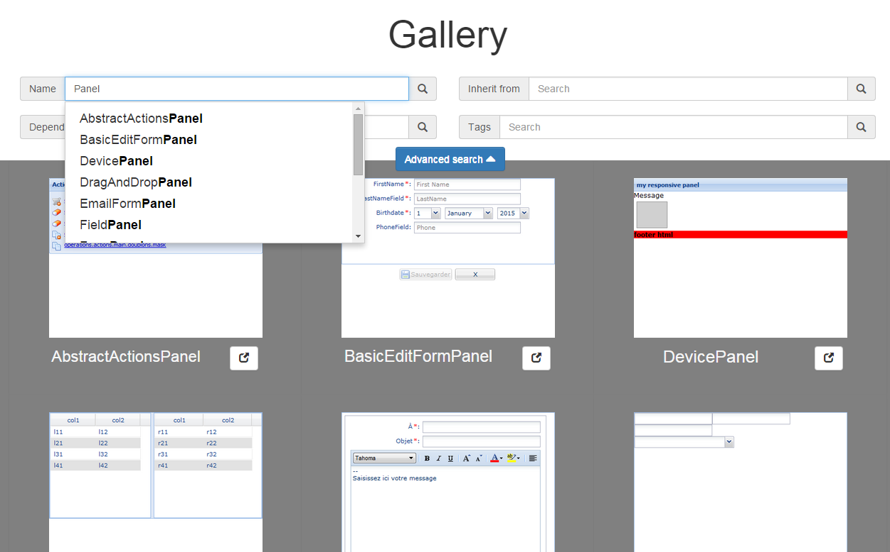
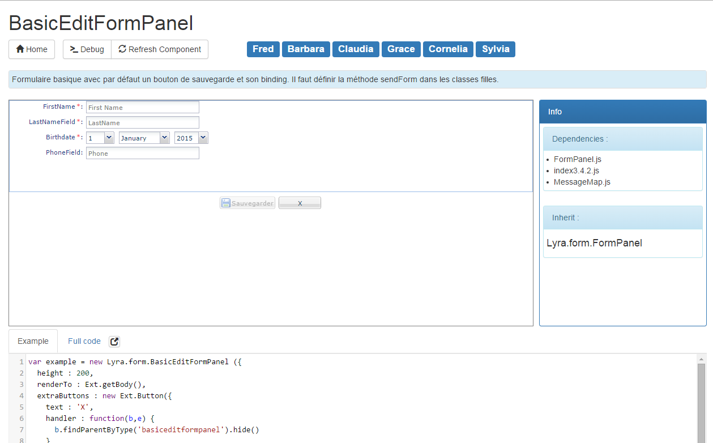

# grunt-gallery

> Generate a web gallery presenting graphic components from various lib (ExtJS, React, etc...)

## Disclaimer

This plug-in was developed during a 3 months intership at [Lyra Network](http://www.lyra-network.com/)

## Getting Started
This plugin requires Grunt.

If you haven't used [Grunt](http://gruntjs.com/) before, be sure to check out the [Getting Started](http://gruntjs.com/getting-started) guide, as it explains how to create a [Gruntfile](http://gruntjs.com/sample-gruntfile) as well as install and use Grunt plugins. Once you're familiar with that process, you may install this plugin with this command:

```shell
npm install grunt-gallery --save-dev
```

Once the plugin has been installed, it may be enabled inside your Gruntfile with this line of JavaScript:

```js
grunt.loadNpmTasks('grunt-gallery');
```

## The "gallery" task

### Overview
In your project's Gruntfile, add a section named `gallery` to the data object passed into `grunt.initConfig()`.

```js
    var persoTitle = function( path, compName) {
        return 'test'+compName;
    };
    grunt.initConfig({
        gallery: {
            Ext : {
                title : 'Ext gallery',
                files: {
                    src : './privateRessources/extComp',
                    dest : './dist/gallery'
                },
                template : './views/gallery.jade',
                dependencies : {
                    js : ['ext.min.js'],
                    css : 'custom.css',
                    images : '/images/'
                },
                compNameCallback : persoTitle,
                regexps : {
                    inherit: {
                        pattern : '(?:Ext.extend\\()(.*),',
                        flags : 'g'
                    }
                }
            },
        },
    })
```
### Title

The future title of the gallery, defaul : 'Gallery'

### Files

#### Files.src

The directory containing all the component you want to generate gallery from. Be careful, only put one and only onde directory, multiple source dir is currently not supported.

#### Files.dest

Directory you to put the gallery in.

### Template

The jade template where each component will be rendered, it is important to note that in order to correctly render component for some lib you will have to slightly modify the folowing template by changing instantation js code.

Example

```
    doctype html
    html
        head
            meta(http-equiv="content-type", content="text/html; charset=UTF-8")
            title #{name}
            |         
            link(rel='stylesheet', type='text/css', href='../css/iframe.css')
            |         
        body
            button#button-ct
        script(type='text/javascript', src='../js/iframe.js')
        script(type='text/javascript', src='../'+file)
        each ex in example
            // has to be modify
            script(type='text/javascript')
                | Ext.onReady( function() {
                | #{ex} 
                | });
```

### Dependancies

Write here all the dependancies of your templates, all those files will be later concat in a single file.


### CompNameCallback

An optional callback you can define if you want to add additional information when you display name of the component (path for example). Callback will take in parameter path of the component and its name, it should return the future name of the component.

### Regexps

#### Inherit

You should define here the regexp making it possible to catch inherithance for your comp. The one given in example is for extJS.

## Output directory

```
    \
    |__ css/                   contains css concat files 
          |__ gallery.css
          |__ index.css
          |__ iframe.css
    |__ fonts/
    |__ gallery/               contains the html page with comp enbeded in iframe + other information
          |__ comp1.html
          |__ comp2.html
    |__ iframe/                contains the html only displaying component, generated from template passed in parameter
          |__ comp1.html
          |__ comp2.html
    |__ images/                   contains all img dependancies
    |__ img/                contains all the screenshot generated from iframe/
          |__ comp1.html.png
          |__ comp2.html.png
    |__ js/                    contains js concat files
          |-- comp/                 copy of components
          |__ gallery.js
          |__ index.js
          |__ iframe.js
    |__ info.json              contains all the information extracted from components in JSON
    |__ index.html             index of the gallery

```

## Output
 
This is what the output will look like :


And the page for a component will look like :



### Features :

* Display interactable component
* Display instanciation code of component
* Ability to search component from name, dependencies and inherit
* Autocompletion in research
* Ability to show multiple example
* Extract information such as dependencies and inherit
* Entirely customizable

## Contributing
In lieu of a formal styleguide, take care to maintain the existing coding style. Add unit tests for any new or changed functionality. Lint and test your code using [Grunt](http://gruntjs.com/).

## Release History
_(Nothing yet)_

## License
Copyright (c) 2015 Pierre de Wulf. Licensed under the MIT license.
